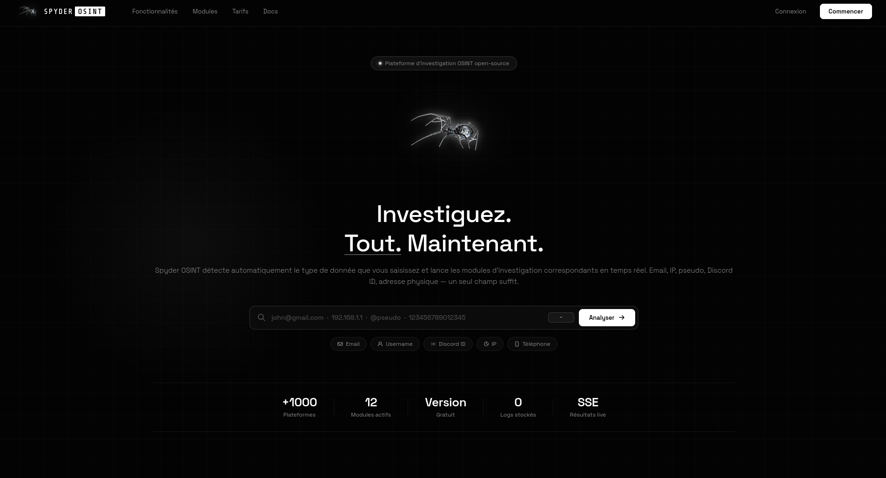

# SpyderOSINT 🕵️‍♂️🕷️

**SpyderOSINT** est un outil d'investigation open-source (OSINT) conçu pour automatiser la collecte d'informations, la reconnaissance et la cartographie de données à partir de sources publiques. Alliant la précision d'un crawler et la discrétion d'une araignée, il permet aux chercheurs en sécurité, analystes et passionnés d'OSINT de centraliser leurs recherches en un temps record.

## 🚀 Fonctionnalités Clés

* **Collecte Multi-Sources :** Scan automatique des réseaux sociaux, des moteurs de recherche et des bases de données publiques.
* **Analyse de Noms de Domaine & IPs :** Récupération des enregistrements WHOIS, sous-domaines, et historiques DNS.
* **Extraction d'E-mails & Fuites de Données :** Identification des adresses associées à une cible et vérification des brèches de sécurité connues.
* **Visualisation des Relations :** Cartographie des liens entre les différentes entités trouvées (utilisateurs, domaines, serveurs).
* **Rapports Exportables :** Génération de rapports d'investigation propres aux formats JSON, CSV ou HTML.




## 🛠️ Installation

```bash
# Cloner le dépôt
git clone [https://github.com/votre-utilisateur/SpyderOSINT.git](https://github.com/votre-utilisateur/SpyderOSINT.git)

# Accéder au dossier
cd SpyderOSINT
